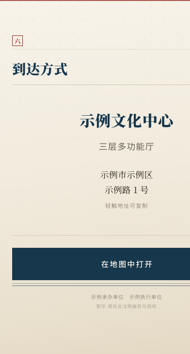

# 微信 H5 邀请函与营销画册

用代码生成微信端的 H5 邀请函／营销长页，替代稿定、易企秀这类在线编辑器。

产出两件能直接发出去的东西：**一张海报**（扫码用）和**一个详情页**（一屏一章、滑动翻页）。
纯静态 HTML，没有平台水印和"投诉"入口，链接是自己的域名，改一个字重新上传就生效，
已经转发出去的链接自动变新版。

<table>
<tr>
<td width="33%"></td>
<td width="33%"></td>
<td width="33%"></td>
</tr>
<tr>
<td align="center"><sub>封面</sub></td>
<td align="center"><sub>日程</sub></td>
<td align="center"><sub>到达方式</sub></td>
</tr>
</table>


> 图中为虚构的示例活动。

---

## 这个项目是什么

**一套给 AI 用的操作手册 ＋ 两个调好的成品模板。**

GitHub 上已有的开源 H5 工具（Luban-H5、H5DS 等）都是"自己造一个易企秀"——
可视化拖拽编辑器，你还是要拖组件。这个项目走另一条路：把设计判断和踩过的坑
固化成 AI 能执行的指令，你说清楚活动信息，AI 改模板，你拿到成品。

**不是**：不是可视化编辑器，不是模板市场，也不能替代稿定的所见即所得体验。
如果你要的是"打开网页拖拖拽拽出图"，稿定更合适。

**适合**：活动邀请函、课程招募、发布会预告、论坛议程、招商画册 ——
凡是"发一张海报、扫码看详情"的场景。

## 为什么值得换掉在线编辑器

| | 在线 H5 编辑器 | 这套方案 |
|---|---|---|
| 改一个字 | 登录平台编辑器改，重新发布 | 改文件重新上传，链接不变、即时生效 |
| 文字能否复制 | 不能（都是图层） | 能，也能被搜索引擎读到 |
| 链接域名 | 平台的 | 自己的 |
| 页脚 | 平台品牌 ＋ 投诉入口 | 没有 |
| 内容归属 | 存在平台账号里，随订阅走 | 在你自己的仓库和服务器上 |
| 复用 | 每次重新拖 | 改文字即可，结构就是模板 |

代价是要有个地方放页面 —— 从**零成本**到几十元/月都有方案，见下文。

---

## 三种用法

### ① Claude Code（自动触发）

```bash
git clone https://github.com/ai-chu/wechat-h5-deck.git
mkdir -p ~/.claude/skills
cp -r wechat-h5-deck ~/.claude/skills/wechat-h5-deck
```

之后在 Claude Code 里说"帮我做一个 XX 活动的邀请函"就会自动加载。

### ② 豆包 / Kimi / 通义 / WorkBuddy 等国内 AI 工具

这些工具不支持 skill 机制，也不能在你电脑上执行命令，但完全能胜任 ——
因为模板已经是成品，AI 只需要改文字。

打开 **[PROMPT.md](PROMPT.md)**，里面有可以直接复制的提示词和完整步骤。

### ③ 不用 AI，手工改

`templates/deck.html` 里的文字都集中在 `<body>`，每一屏有中文注释标好边界。
用任何文本编辑器打开改就行，`<style>` 一个字都不用动。

---

## 快速开始

1. **想清楚内容**：活动全名、一句话主张、时间地点、日程、行动点。
   清单见 [references/04-内容与结构.md](references/04-内容与结构.md)
2. **改模板**：`templates/deck.html`（详情页）、`templates/poster.html`（海报）
3. **自检**：浏览器窗口调到 375×700，控制台粘贴 `scripts/check-layout.js`，
   任何一屏报超出都要压
4. **出海报**：`./scripts/shot.sh`（没有命令行环境？用浏览器开发者工具截图，
   PROMPT.md 里有说明）
5. **上线**：见 [references/01-部署攻略.md](references/01-部署攻略.md)

---

## 放到网上：三条路

**如果活动在两周内，且需要国内微信传播，请立刻开始域名备案** ——
这一步要 7–20 天，需要本人实名和视频核验，没有任何工具能替你完成。

| 路线 | 成本 | 需要备案 | 适合 |
|---|---|---|---|
| **GitHub Pages** | 0 元 | 否 | 先看效果。国内能开，就是慢些 |
| **对象存储 ＋ 自有域名** | 几十元/年 | **是** | 国内微信正式传播 |
| **云服务器 ＋ Caddy** | 几十元/月 | **是** | 多项目复用、要日志或接口 |

第一条路全程点鼠标，不需要命令行，10 分钟能看到效果。
详细步骤（含"为什么对象存储的默认域名打开会变成下载文件"这类坑）见
[部署攻略](references/01-部署攻略.md)。

---

## 核心资产：那些踩过的坑

这些是实际做项目时栽过、排查过、确认了原因的问题，
通用的落地页教程一条都不会讲。完整清单见
[references/02-微信与iOS适配.md](references/02-微信与iOS适配.md)。

- **iOS 上不要用 Web Audio 合成背景音** —— `AudioContext` 一旦在无用户手势时
  被创建就会被系统**永久锁死**，之后连点按钮都 `resume` 不回来，而且失效是静默的：
  不报错、状态正常、新机型完全正常。老老实实用 `<audio>` 放 mp3
- **微信里可以自动播放音乐**，但要靠 `WeixinJSBridge`，而且事件监听和轮询要
  两条路都留 —— 只监听事件会漏掉"脚本执行时桥已就绪"的情况
- **iPhone 底部的 home indicator 会吃掉约 34px**，`padding-bottom` 漏算
  `env(safe-area-inset-bottom)`，底部内容就会被压住
- **一次滑动只翻一页靠 `scroll-snap-stop: always`**，光有 `mandatory` 不够 ——
  手一甩带出惯性会连翻好几屏
- **测屏高不能用 `scrollHeight`** —— 它把绝对定位的装饰元素也算进去，
  能让你对着不存在的问题反复压缩
- **删 HTML 必须同时删对应的 JS** —— 留下 `getElementById` 的悬空引用，
  脚本会在那一行抛错并**整个中断**，后面所有功能静默失效，而语法检查完全通过

## 一条硬约束

**任何一屏都不许要下拉才能看全。**

陌生用户不知道下面还有内容，被折在屏外的信息对他等于不存在。
设计基准是每屏内容不超过 660px（主流手机在微信里的可视高度约 745–790px，
留余量给小屏机型）。`scripts/check-layout.js` 会逐屏检查。

---

## 目录

```
SKILL.md              Claude Code 技能定义
PROMPT.md             给国内 AI 工具用的提示词
references/
  01-部署攻略.md        三层部署方案、域名备案、常见报错
  02-微信与iOS适配.md    踩坑清单，逐条给解法
  03-设计系统.md        字阶、间距、配色、中文排版规则
  04-内容与结构.md      每屏放什么、文案怎么写
templates/
  deck.html           详情页模板（成品，改文字即可）
  poster.html         海报模板
  config.example.json 信息清单，用来和 AI 对齐
scripts/
  shot.sh             渲染海报 PNG
  check-layout.js     一屏一页自检
```

## 许可

MIT。模板里的示例文案和活动信息均为虚构。

页面里的背景音乐需要自备 —— 建议用 CC0 / CC BY 等免费授权的曲子，
CC BY 要求在页脚署名。
